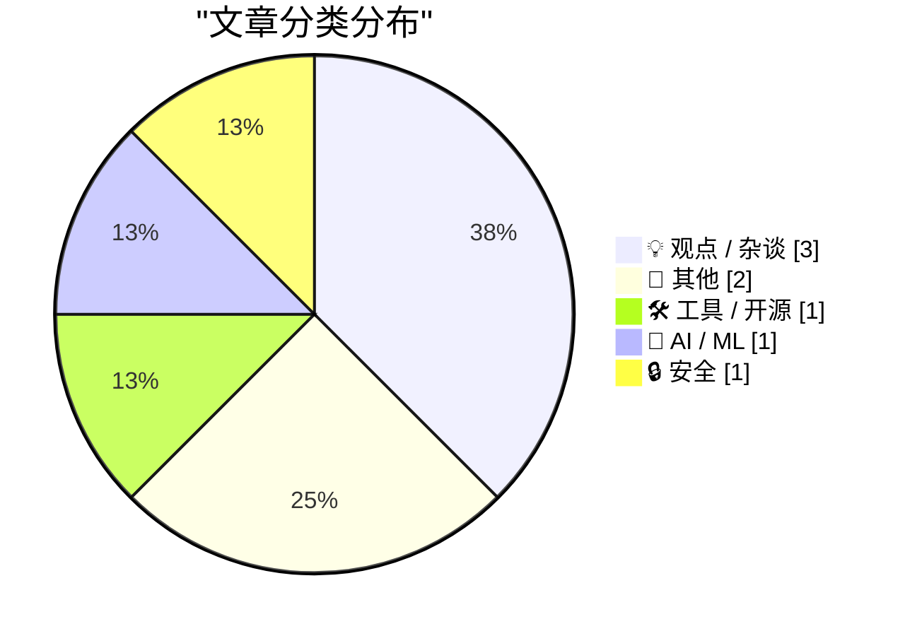
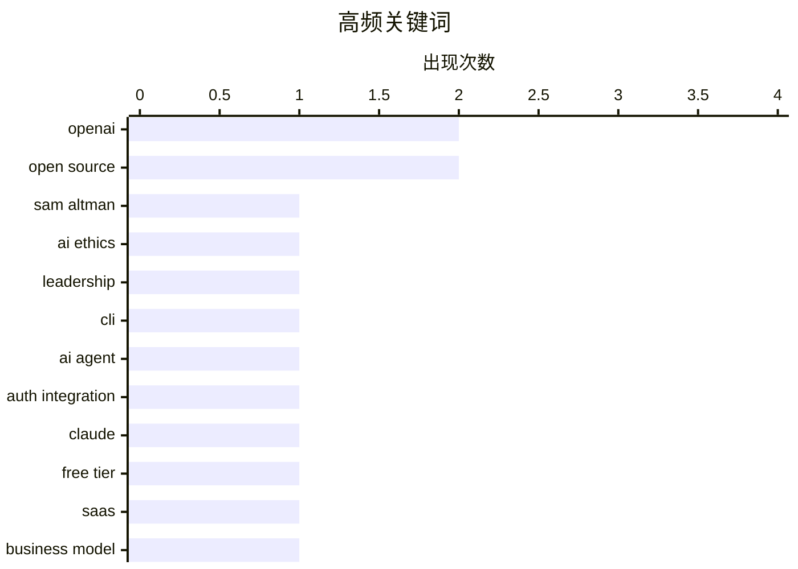

# 📰 AI 博客每日精选 — 2026-03-08

> 来自 Karpathy 推荐的 92 个顶级技术博客，AI 精选 Top 8

## 📝 今日看点

今日技术圈，AI巨头OpenAI及其生态成为焦点，领导层争议与对开源社区的战略扶持并存。一方面，Sam Altman的领导风格再受质疑；另一方面，OpenAI正通过“Codex”计划回馈开源项目。同时，AI驱动的开发者工具正加速普及，简化复杂任务，显著提升开发效率。此外，开源基金会也宣布成立新的工作组，预示着开源生态将迎来更深度的协作与发展。

---

## 🏆 今日必读

🥇 **突发：萨姆·奥特曼的贪婪和不诚实终于让他付出代价**

[BREAKING: Sam Altman’s greed and dishonesty are finally catching up to him](https://garymarcus.substack.com/p/breaking-sam-altmans-greed-and-dishonesty) — garymarcus.substack.com · 14 小时前 · 💡 观点 / 杂谈

> 这篇文章指责OpenAI首席执行官萨姆·奥特曼（Sam Altman）的贪婪和不诚实行为正在给他带来后果。作者加里·马库斯（Gary Marcus）暗示奥特曼长期存在问题行为模式，并认为其在OpenAI的领导角色可能受到这些特质的影响。文章标题直接点明了作者的核心观点，即奥特曼的个人品格缺陷最终会让他付出代价。

💡 **为什么值得读**: 这篇文章提供了对OpenAI领导者萨姆·奥特曼的尖锐批评，对于关注AI伦理和行业领袖行为的读者具有参考价值。

🏷️ Sam Altman, OpenAI, AI Ethics, Leadership

🥈 **‘npx workos’**

[‘npx workos’](https://workos.com/docs/authkit/cli-installer?utm_source=tldrdev&amp;utm_medium=newsletter&amp;utm_campaign=q12026) — daringfireball.net · 10 小时前 · 🛠 工具 / 开源

> 文章介绍了`npx workos`，一个旨在简化认证集成到现有代码库的CLI工具。该工具启动一个由Claude驱动的AI代理，能够智能地读取项目、检测框架，并直接将完整的、定制化的认证集成写入现有代码库。与模板生成器不同，它能理解现有技术栈，并能自动进行类型检查和构建，将错误反馈给自己进行修复。`npx workos`提供了一个先进的、AI驱动的解决方案，以实现无缝且自动纠错的认证集成，显著简化了开发工作流程。

💡 **为什么值得读**: 这篇文章介绍了WorkOS利用AI（Claude）实现智能代码集成和自动纠错的创新工具，展示了AI在开发工具领域的实际应用潜力。

🏷️ CLI, AI Agent, Auth Integration, Claude

🥉 **漏斗中的幽灵**

[The Ghost in the Funnel](https://worksonmymachine.ai/p/the-ghost-in-the-funnel) — worksonmymachine.substack.com · 18 小时前 · 💡 观点 / 杂谈

> 这篇文章探讨了软件产品提供“免费层级”的隐性成本和影响，特别是它如何吸引那些将其视为短期副项目的用户。文章指出，许多免费层级用户并非认真的长期客户，而是从事“二十分钟副项目”的个人，他们消耗资源却不转化为付费计划。这种现象在转化漏斗中制造了一个“幽灵”，使得准确评估潜在客户价值和资源分配变得困难。因此，提供免费层级的企业必须理解其免费用户群体的真实性质，以优化其漏斗并避免误读参与度指标。

💡 **为什么值得读**: 这篇文章深入分析了免费增值模式中“免费用户”的真实行为模式及其对业务漏斗的隐性影响，为产品策略和资源分配提供了新的视角。

🏷️ Free Tier, SaaS, Business Model, Product Strategy

---

## 📊 数据概览

| 扫描源 | 抓取文章 | 时间范围 | 精选 |
|:---:|:---:|:---:|:---:|
| 89/92 | 2514 篇 → 8 篇 | 24h | **8 篇** |

### 分类分布



### 高频关键词



<details>
<summary>📈 纯文本关键词图（终端友好）</summary>

```
openai           │ ████████████████████ 2
open source      │ ████████████████████ 2
sam altman       │ ██████████░░░░░░░░░░ 1
ai ethics        │ ██████████░░░░░░░░░░ 1
leadership       │ ██████████░░░░░░░░░░ 1
cli              │ ██████████░░░░░░░░░░ 1
ai agent         │ ██████████░░░░░░░░░░ 1
auth integration │ ██████████░░░░░░░░░░ 1
claude           │ ██████████░░░░░░░░░░ 1
free tier        │ ██████████░░░░░░░░░░ 1
```

</details>

### 🏷️ 话题标签

**openai**(2) · **open source**(2) · **sam altman**(1) · ai ethics(1) · leadership(1) · cli(1) · ai agent(1) · auth integration(1) · claude(1) · free tier(1) · saas(1) · business model(1) · product strategy(1) · claude max(1) · ai(1) · maintainers(1) · cybersecurity(1) · history(1) · computer crime(1) · mainframes(1)

---

## 💡 观点 / 杂谈

### 1. 突发：萨姆·奥特曼的贪婪和不诚实终于让他付出代价

[BREAKING: Sam Altman’s greed and dishonesty are finally catching up to him](https://garymarcus.substack.com/p/breaking-sam-altmans-greed-and-dishonesty) — **garymarcus.substack.com** · 14 小时前 · ⭐ 26/30

> 这篇文章指责OpenAI首席执行官萨姆·奥特曼（Sam Altman）的贪婪和不诚实行为正在给他带来后果。作者加里·马库斯（Gary Marcus）暗示奥特曼长期存在问题行为模式，并认为其在OpenAI的领导角色可能受到这些特质的影响。文章标题直接点明了作者的核心观点，即奥特曼的个人品格缺陷最终会让他付出代价。

🏷️ Sam Altman, OpenAI, AI Ethics, Leadership

---

### 2. 漏斗中的幽灵

[The Ghost in the Funnel](https://worksonmymachine.ai/p/the-ghost-in-the-funnel) — **worksonmymachine.substack.com** · 18 小时前 · ⭐ 23/30

> 这篇文章探讨了软件产品提供“免费层级”的隐性成本和影响，特别是它如何吸引那些将其视为短期副项目的用户。文章指出，许多免费层级用户并非认真的长期客户，而是从事“二十分钟副项目”的个人，他们消耗资源却不转化为付费计划。这种现象在转化漏斗中制造了一个“幽灵”，使得准确评估潜在客户价值和资源分配变得困难。因此，提供免费层级的企业必须理解其免费用户群体的真实性质，以优化其漏斗并避免误读参与度指标。

🏷️ Free Tier, SaaS, Business Model, Product Strategy

---

### 3. Pluralistic：有了RSS，网络变得可以忍受（2026年3月7日）

[Pluralistic: The web is bearable with RSS (07 Mar 2026)](https://pluralistic.net/2026/03/07/reader-mode/) — **pluralistic.net** · 15 小时前 · ⭐ 16/30

> 这篇文章倡导RSS订阅源和“阅读模式”作为有效浏览和消费网络内容的重要工具，强调其持续的相关性和实用性。文章认为，RSS结合浏览器“阅读模式”能显著改善网页浏览体验，通过过滤干扰并以简洁、可读的格式呈现内容。这种方法帮助用户在混乱的现代网络中管理信息过载并保持专注。作者强调，在当前信息爆炸的互联网环境中，RSS和阅读模式是提高内容消费效率和改善用户体验的关键。

🏷️ RSS, Web, Reader Mode, Link Aggregator

---

## 📝 其他

### 4. 阅读清单 2026年3月7日

[Reading List 03/07/2026](https://www.construction-physics.com/p/reading-list-03072026) — **construction-physics.com** · 20 小时前 · ⭐ 19/30

> 这篇文章是一个精选的阅读清单，汇总了不同领域的各种新闻和发展。涵盖的主题包括数据中心脱离电网、太阳能光伏效率新纪录、战略石油储备的修复、福特电动汽车（EV）的失误，以及前OpenAI首席技术官新创公司的成立。该阅读清单提供了能源、汽车、AI等多个领域的重要动态和趋势的概览。

🏷️ Reading List, Data Centers, EVs, OpenAI

---

### 5. 宣布成立新的工作组

[Announcing New Working Groups](https://nesbitt.io/2026/03/07/announcing-new-working-groups.html) — **nesbitt.io** · 23 小时前 · ⭐ 18/30

> 开源基金会联盟（Open Source Foundations Consortium）宣布成立了新的工作组。具体而言，该联盟旗下已设立了七个新的工作组。文章暗示这些工作组将专注于开源开发、治理或相关倡议的各个方面，尽管具体细节在摘要中未提供。开源基金会联盟通过成立七个新的工作组，进一步扩展了其在开源领域的工作范围和影响力。

🏷️ Open Source, Working Groups, Consortium, Governance

---

## 🛠 工具 / 开源

### 6. ‘npx workos’

[‘npx workos’](https://workos.com/docs/authkit/cli-installer?utm_source=tldrdev&amp;utm_medium=newsletter&amp;utm_campaign=q12026) — **daringfireball.net** · 10 小时前 · ⭐ 23/30

> 文章介绍了`npx workos`，一个旨在简化认证集成到现有代码库的CLI工具。该工具启动一个由Claude驱动的AI代理，能够智能地读取项目、检测框架，并直接将完整的、定制化的认证集成写入现有代码库。与模板生成器不同，它能理解现有技术栈，并能自动进行类型检查和构建，将错误反馈给自己进行修复。`npx workos`提供了一个先进的、AI驱动的解决方案，以实现无缝且自动纠错的认证集成，显著简化了开发工作流程。

🏷️ CLI, AI Agent, Auth Integration, Claude

---

## 🤖 AI / ML

### 7. 面向开源的 Codex

[Codex for Open Source](https://simonwillison.net/2026/Mar/7/codex-for-open-source/#atom-everything) — **simonwillison.net** · 15 小时前 · ⭐ 22/30

> 文章宣布OpenAI为开源项目维护者推出了新的福利，此前Anthropic也发布了类似计划。OpenAI现在为拥有5000+星标或100万+NPM下载量的流行开源项目维护者提供六个月的ChatGPT Pro服务，其中包括Codex访问权限。此项福利与Anthropic此前宣布的六个月免费Claude Max服务类似，两者每月价格均为200美元。随着OpenAI的加入，AI巨头们正通过提供免费高级AI工具来支持和激励开源社区。

🏷️ Claude Max, Open Source, AI, Maintainers

---

## 🔒 安全

### 8. 书评：《电子罪犯》（1975年）——罗伯特·法尔著

[Book Review: The Electronic Criminals by Robert Farr (1975) ★★★⯪☆](https://shkspr.mobi/blog/2026/03/book-review-the-electronic-criminals-by-robert-farr-1975/) — **shkspr.mobi** · 20 小时前 · ⭐ 19/30

> 这篇书评回顾了1975年出版的《电子罪犯》一书，探讨了一本五十年前的著作能如何启发我们理解现代网络安全。该书在计算机技术刚刚兴起时撰写，描述了早期的网络犯罪形式，如电传欺诈、涉及物理磁带的勒索软件、窃取密码和入侵大型机。尽管开篇通过详细描述这些“可怕的新型犯罪”引人入胜，但评论指出，由于当时网络犯罪的范围有限，内容最终“后劲不足”。尽管内容受限于时代，这本书仍能提供对早期网络安全威胁的独特历史视角，并揭示了某些犯罪模式的持久性。

🏷️ Cybersecurity, History, Computer Crime, Mainframes

---

*生成于 2026-03-08 09:20 | 扫描 89 源 → 获取 2514 篇 → 精选 8 篇*
*基于 [Hacker News Popularity Contest 2025](https://refactoringenglish.com/tools/hn-popularity/) RSS 源列表，由 [Andrej Karpathy](https://x.com/karpathy) 推荐*
*由「懂点儿AI」制作，欢迎关注同名微信公众号获取更多 AI 实用技巧 💡*
